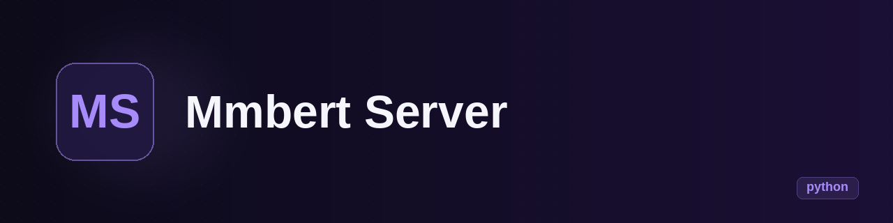

<p align="center">
  
</p>

<h1 align="center">mmbert_server</h1>

<p align="center"><b>A single-file ONNX intent-classifier server that exposes an OpenAI-compatible endpoint for Kateto.</b></p>

<p align="center">
  
  
  
  
</p>

---

## What it is

`mmbert_server` (package name `kateto-classifier-mmbert`) is a small HTTP server that classifies the
intent of a chat message into one of three categories — `EXECUTE`, `IGNORE_SELF_TALK`,
`IGNORE_THIRD_PARTY` — using embedding similarity instead of a trained classifier. It embeds text
with MiniLM (`Qdrant/all-MiniLM-L6-v2-onnx`, 384-d, mean-pooled, L2-normalised), compares it by
cosine similarity against per-class prototype sentence centroids, and returns
`{"category": ..., "confidence": ...}` wrapped in an OpenAI-compatible
`POST /v1/chat/completions` response, so it can plug into anything expecting that shape
(in practice: Kateto's `ClassifierProvider` contract).

**In one sentence:** it decides whether a chat utterance is addressed to the assistant or is
self-talk / third-party chatter, so the agent only acts on messages meant for it.

## State

| | |
|---|---|
| **State** | prototype |
| **Last activity** | 2026-07 (feat commits); docs generated 2026-09 |
| **Usable today** | yes, as a local sidecar: `python server.py` and POST to `/v1/chat/completions` |
| **What's missing** | no trained head (hand-written prototype sentences); no tests; no CI; no LICENSE; training pipeline not wired to `classifiers/mmbert/training/` |
| **Known risks / debt** | prototypes are heuristic (noted in code as "ponytail"); the `agents` boost (+0.25 logit on substring match) is a blunt heuristic; single 400-line file; GPU path depends on a Vulkan-capable onnxruntime build |

## Why it exists

Kateto (an agent orchestration project by the same author) needs to filter a chat stream:
not everything said is directed at the agent. Rather than a full LLM call for every utterance,
this runs a tiny local model (MiniLM via ONNX, optional Vulkan GPU) and answers in milliseconds,
keeping the OpenAI-compatible response format so Kateto can swap providers.


Requirements: Python ≥ 3.12, [uv](https://docs.astral.sh/uv/) (or plain pip), network access on
first run (downloads tokenizer + ONNX model from HuggingFace Hub).

```bash
# with uv (repo ships uv.lock)
uv venv && uv sync
uv run python server.py                 # http://127.0.0.1:8091

# or with pip
python -m venv .venv && source .venv/bin/activate
pip install -e .
python server.py
```

Flags: `--port 9091`, `--host 0.0.0.0`, `--model path/to/model.onnx` (local path or HF repo id),
`--no-vulkan` (CPU only), `--log-level DEBUG`.

Example request:

```bash
curl -s localhost:8091/v1/chat/completions -H 'content-type: application/json' -d '{
  "messages": [{"role": "user", "content": "good morning team, let us start the standup"}],
  "agents": ["Jane"]
}'
# -> {"choices":[{"message":{"content":"{\"category\": \"EXECUTE\", \"confidence\": 0.xx}"}}]}
```

`GET /health` returns `{"status": "ok"}`.

## Stack

- **Language / runtime:** Python ≥ 3.12, single module (`server.py`), entry point `kateto-classifier = server:main`
- **Main dependencies:** FastAPI + Uvicorn, `onnxruntime-gpu` (CPU + Vulkan execution providers), `tokenizers`, `huggingface-hub`, NumPy
- **Model:** `all-MiniLM-L6-v2` ONNX from Qdrant (downloaded on first run, cached by HF Hub)
- **Notably not used:** PyTorch / Transformers runtime (only the tokenizer + ONNX graph), and no vector DB — prototypes live in memory

## Architecture

Everything lives in one file, in clear stages:

```
tokenizer.json (HF Hub) ─┐
model.onnx (HF Hub) ─────┴─► ONNX Runtime session ─► mean-pool + L2 norm ─► cosine vs 3 class centroids
                                    ─► (+agents boost) ─► softmax confidence ─► OpenAI-shaped JSON
```

- `PROTOTYPES` — hand-written example sentences per category (English and Spanish), embedded once at startup into per-class centroids
- `PrototypeClassifier` — nearest-centroid classification with cosine similarity; boosts `EXECUTE` when the text contains one of the known agent names
- FastAPI app — `POST /v1/chat/completions` (last user/system message is the input; optional `agents` list) and `GET /health`

## Repo structure

```
server.py         # the whole server: model loading, embedding, classifier, FastAPI app, CLI
pyproject.toml    # package metadata and dependencies (uv-compatible)
uv.lock           # locked dependency set
docs/overview.md  # auto-generated overview (from a prior documentation batch)
```

## Roadmap

- [x] ONNX + Vulkan inference, OpenAI-compatible endpoint
- [ ] Replace heuristic prototypes with learned centroids from labeled data (`classifiers/mmbert/training/`)
- [ ] Add tests and a minimal CI
- [ ] Pin a proper license

## Notes and decisions

- **Similarity instead of a trained classifier:** with 3 coarse classes, centroid similarity over
  hand-picked prototype sentences is enough to start; the code comments flag this explicitly as
  temporary ("swap for learned embeddings when labeled data exists").
- **Vulkan GPU:** `onnxruntime-gpu` is configured to try `VulkanExecutionProvider` first and fall
  back to CPU automatically if Vulkan is unavailable — useful on machines without CUDA.
- **OpenAI response shape:** the classifier result is JSON-encoded inside
  `choices[0].message.content` so the server satisfies Kateto's `ClassifierProvider` contract
  without a custom client.
- The current `README.md` and `docs/overview.md` in the repo are auto-generated placeholders from a
  batch documentation run (2026-09); this document is the real description.

## License

None declared. Private/personal project until the owner picks one (MIT or GPL-3.0 suggested).

---
